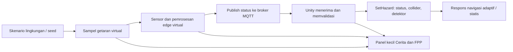

# Pembagian tugas 2 orang: simulasi getaran, edge device, MQTT, dan cutscene

Tanggal: 25 September 2026. Status: **rencana implementasi berdasarkan pemeriksaan kode saat ini**. Dokumen ini membagi pekerjaan; MQTT, pemrosesan getaran, dan panel cutscene di bawah belum diimplementasikan oleh perubahan dokumentasi ini.

## 1. Tujuan dan koreksi kondisi saat ini

Simulasi harus memperlihatkan hubungan sebab-akibat: **getaran lingkungan virtual → sensor/edge device mendeteksi → pesan MQTT → status bahaya dan respons navigasi → visualisasi pada Mode Cerita dan FPP**. Bahaya harus bisa terdeteksi ketika karakter masih jauh atau diam.

Hasil pemeriksaan proyek:

| Bagian | Kondisi aktual | Perubahan yang dituju |
|---|---|---|
| Scene utama | `Assets/Scenes/SafeMining_Experience.unity` | Tetap menjadi scene integrasi Cerita dan FPP |
| Pemicu bahaya | `MiningSimulation.RunTimeline()` memanggil `SetHazard()` berdasarkan waktu dari `MiningHazardScenario` | Pada mode baru, skenario menghasilkan sampel getaran; keputusan bahaya melewati edge dan MQTT |
| Jarak karakter | `CheckExposure()` menghitung paparan dekat bahaya yang sudah aktif; jarak juga digunakan untuk navigasi/HUD | Tetap untuk paparan dan gerak, tidak menjadi pemicu sensor |
| Komunikasi | `MiningTelemetry.cs` dan `Tools/telemetry_server.py` menggunakan WebSocket | Tambahkan transport MQTT tersendiri dan pilihan sumber data yang jelas |
| Detektor | `MiningLandslideDetector.cs` menampilkan status yang diberikan simulasi | Tambahkan visual nilai getaran, proses deteksi, dan status pengiriman/penerimaan |
| Visualisasi | Detektor, sirene, HUD, minimap, Cerita dan FPP sudah tersedia | Tambahkan panel kecil untuk close-up getaran dan edge device |

Jadi, MQTT memang belum tersedia. Namun pada scene utama, kode yang diperiksa memakai **jadwal waktu**, bukan karakter mendekat sebagai pemicu aktivasi bahaya. Jika perilaku mendekat masih terlihat saat demo, periksa scene yang dibuka dan komponen yang aktif. `SafeMiningEvac_Demo.unity` menggunakan pengendali lama dan bukan sasaran pekerjaan ini.

Istilah *set point* perlu dibedakan: titik lokasi sensor tetap boleh ada; ambang pembacaan getaran juga boleh ada. Yang harus dihilangkan dari alur baru adalah ketergantungan aktivasi sensor pada posisi karakter atau pemanggilan status bahaya langsung dari timeline.

Asumsi desain: “edge device terpicu lewat getaran” berarti perangkat virtual **membaca getaran tanah/dinding tambang**, lalu memberi alarm. Animasi perangkat bergetar membantu menjelaskan pembacaan tersebut. Motor getar wearable atau perangkat fisik belum menjadi lingkup tahap ini.

## 2. Alur simulasi yang harus dibangun



1. Skenario menentukan lokasi, waktu mulai, dan profil getaran dengan seed yang dapat diulang. Karakter boleh diam atau berada jauh dari lokasi tersebut.
2. Sensor virtual menghasilkan nilai getaran per perangkat. Gunakan nilai normalisasi `0..1` pada tahap awal dan tulis **intensitas simulasi**, bukan angka pengukuran fisik.
3. Edge virtual memproses sampel dengan ambang dan durasi minimum. Contoh parameter demo: warning jika nilai ≥ `0.45` selama `0.5` detik; danger jika ≥ `0.75` selama `0.5` detik. Parameter ini usulan awal yang harus dapat dikonfigurasi dan dicatat, bukan standar keselamatan tambang.
4. Gunakan ambang turun berbeda dan durasi stabil agar noise tidak membuat status bolak-balik. Status `2` yang sudah menutup lorong tetap terkunci sampai reset sesi atau perintah pemulihan eksplisit; getaran mereda tidak otomatis menghapus longsor.
5. Edge virtual memublikasikan hasil ke broker MQTT. Subscriber Unity menerima hasil, memvalidasi sesi/perangkat/urutan, lalu menerapkannya melalui satu jalur integrasi.
6. Pertahankan arti status proyek: `0 = normal`, `1 = waspada`, `2 = tertutup`. Untuk demo awal, keputusan danger dipetakan ke status `2` dan memicu longsor virtual. Ini aturan skenario, bukan klaim bahwa getaran tinggi membuktikan lorong fisik sudah tertutup.
7. Panel memperlihatkan getaran, pembacaan sensor, keputusan edge, dan hasil penerimaan Unity. Teks “diterapkan” baru tampil setelah penerimaan dan penerapan sukses, bukan saat animasi selesai.

**Pilihan sumber bahaya harus saling eksklusif:**

| Pilihan yang akan ditambahkan | Perilaku |
|---|---|
| `LegacyTimeline` | Mempertahankan demo lama sebagai pembanding/regresi; diberi label berbasis jadwal |
| `LocalEdgeSimulation` | Getaran → edge virtual → penerapan lokal; diberi label simulasi lokal tanpa MQTT |
| `MqttEdgeSimulation` | Getaran → edge virtual → broker MQTT → subscriber Unity → penerapan; dipakai untuk demonstrasi MQTT |

Pada pilihan MQTT, nonaktifkan penulisan status dari timeline lama, jalur lokal, dan perintah WebSocket. Jangan diam-diam berpindah ke lokal saat broker putus. Tampilkan koneksi terputus dan pertahankan status terakhir dengan penanda data tidak diperbarui. Mode tampilan Cerita/FPP dan metode navigasi adaptif/statis tetap merupakan pilihan terpisah dari sumber bahaya.

Edge virtual tahap awal boleh berada dalam proses Unity, dengan modul terpisah. Pesan tetap wajib melewati broker nyata ketika pilihan MQTT digunakan. Pemisahan ke proses/perangkat fisik merupakan tahap lanjutan, sehingga demo ini tidak diklaim sebagai deployment edge fisik.

## 3. Pembagian tugas

### Orang 1 — getaran, edge, MQTT, dan integrasi simulasi

Pemilik logika bahaya dan integrasi inti. Orang 1 juga menjadi integrator akhir untuk file scene dan konfigurasi bersama.

| ID | Pekerjaan | Hasil yang diserahkan | Kriteria selesai |
|---|---|---|---|
| A1 | Tetapkan kontrak pesan, ID perangkat, sumber bahaya, dan event UI bersama Orang 2 | Kontrak terdokumentasi dan tipe data bersama | Kedua orang memakai ID dan arti status yang sama |
| A2 | Buat generator sampel getaran deterministik, profil normal/warning/danger, serta reset | Modul getaran virtual dan parameter Inspector | Input sama menghasilkan sampel sama meski karakter berpindah |
| A3 | Buat pemrosesan edge: ambang, durasi minimum, hysteresis, dan status terkunci | Modul edge terpisah dari visual | Noise singkat tidak memicu bahaya; pemulihan tidak membuka longsor otomatis |
| A4 | Tambahkan client MQTT, konfigurasi broker lokal, publish/subscribe, serta status koneksi | Adapter MQTT dan petunjuk menjalankan broker | Pesan benar-benar melewati broker dan kembali ke Unity |
| A5 | Integrasikan hasil pada `MiningSimulation` melalui satu pintu penerapan | Pemilihan sumber, validasi pesan, event hasil penerapan | Tidak ada pemicu ganda dari timeline/WebSocket; Unity API dipanggil di main thread |
| A6 | Tangani pause, reset, reconnect, pesan lama/duplikat, dan penghentian sesi | Siklus sesi konsisten dan log penolakan | Pesan sesi lama tidak memengaruhi sesi baru |
| A7 | Tambahkan pencatatan event dan jalankan uji logika/integrasi | Log getaran → keputusan → publish → receive → apply → route | Satu kejadian dapat ditelusuri dengan ID yang sama |

Lokasi baru yang diusulkan, **belum tersedia**:

- `Assets/Scripts/Edge/`: kontrak pesan, generator getaran, pemrosesan edge, event penghubung UI.
- `Assets/Scripts/Networking/`: adapter MQTT dan konfigurasi koneksi.
- `Tools/Mqtt/`: konfigurasi broker lokal, contoh payload, dan petunjuk menjalankan demo.

File lama yang boleh diubah Orang 1 secara terbatas: `MiningSimulation.cs`, `MiningHazardScenario.cs`, serta titik pengaktifan/nonaktif `MiningTelemetry.cs`. Pertahankan planner, gerakan, ekspor lama, dan pilihan skenario yang masih diperlukan untuk regresi.

### Orang 2 — visual perangkat, panel cutscene, dan pengalaman pengguna

Pemilik presentasi visual. UI membaca data/event dari Orang 1 dan tidak menetapkan status bahaya.

| ID | Pekerjaan | Hasil yang diserahkan | Kriteria selesai |
|---|---|---|---|
| B1 | Susun posisi panel pada HUD Cerita dan FPP | Rancangan panel dan mock data sesuai kontrak A1 | Tidak menutupi minimap, petunjuk arah, dialog, dan menu |
| B2 | Buat kamera close-up perangkat dan keluaran `RenderTexture` | Kamera tambahan dan panel `RawImage` | Kamera utama dan gerakan karakter tetap berjalan |
| B3 | Buat animasi getaran lokal, grafik/bar pembacaan, lampu, dan indikator edge | Visual sensor → proses → status pesan | Nilai berasal dari data edge; animasi tidak memicu bahaya |
| B4 | Hubungkan panel dengan event pembacaan, keputusan, koneksi, dan penerapan | Panel aktif pada Cerita dan FPP | ID perangkat, status, dan waktu sesuai kejadian nyata |
| B5 | Tangani beberapa kejadian, prioritas, pause, reset, dan panel ringkas | Perilaku UI konsisten | Danger terbaru diprioritaskan; event duplikat tidak mengulang cutscene |
| B6 | Periksa tampilan dan kontrol pada beberapa resolusi | Screenshot/video dua mode dan catatan uji | FPP tetap dapat bergerak/melihat; UI terbaca dan tidak tumpang tindih |
| B7 | Perbarui panduan penggunaan dan demo | Dokumentasi visual serta urutan presentasi | Pembaca bisa mengikuti alur tanpa penjelasan dari pembuat |

Lokasi baru yang diusulkan, **belum tersedia**:

- `Assets/Scripts/Visualization/`: pengendali panel dan kamera cutscene.
- `Assets/Resources/Mining/EdgeVisualization/`: prefab dan resource khusus visual perangkat.
- `Documentation/Previews/`: bukti visual baru dengan nama yang membedakan versi.

File lama milik Orang 2: `MiningHUD.cs`, `MiningLandslideDetector.cs`, dan `Assets/Resources/Mining/LandslideDetector.prefab`. Perubahan komponen/prefab harus mempertahankan referensi yang dipakai `BuildHazards()` dan generator detektor. Serahkan kebutuhan wiring scene kepada Orang 1.

## 4. Kontrak kerja penghubung kedua orang

Kontrak berikut adalah usulan awal yang disepakati pada A1 sebelum implementasi paralel. Jangan mengubah nama field atau maknanya sepihak.

| Bagian | Kesepakatan |
|---|---|
| Identitas | `sessionId` baru setiap Begin/reset; `layoutId` untuk denah; `deviceId` seperti `D01` dipetakan ke indeks detektor sesuai konfigurasi sesi |
| Urutan | `sequence` meningkat per perangkat per sesi; `eventId` menghubungkan keputusan, pesan, dan penerapan |
| Nilai sensor | `vibrationNormalized` dalam `0..1`; profil/seed/ambang/durasi disimpan dalam konfigurasi ekspor |
| Status | `level` hanya `0`, `1`, atau `2`; status kandidat edge dipisahkan dari status yang sudah diterapkan Unity |
| Waktu | `simulationTimeS` untuk urutan eksperimen; durasi proses/transport diukur dengan clock monoton lokal; jangan mencampurnya dengan waktu simulasi |
| Topik status | `safe-mining/v1/{sessionId}/edge/{deviceId}/status` |
| Transport demo | QoS 1, retain nonaktif untuk event; implementasi tetap menyaring duplikat, urutan lama, dan sesi yang tidak cocok |
| Batas penerimaan | Tolak JSON rusak, field wajib hilang, nilai di luar rentang, perangkat/denah asing, serta topik dan payload yang tidak cocok |
| UI | Kontrak event yang diusulkan: `VibrationSampled`, `EdgeStateChanged`, `TransportStateChanged`, `HazardApplied`; UI tidak memanggil `SetHazard()` |
| Thread | Callback jaringan memasukkan pesan ke antrean; validasi/penerapan dan event UI dilakukan di main thread Unity |

Contoh payload status (data ilustrasi, bukan hasil pengukuran):

```json
{
  "schemaVersion": 1,
  "sessionId": "demo-001",
  "layoutId": "L01",
  "eventId": "demo-001-D01-17",
  "deviceId": "D01",
  "sequence": 17,
  "simulationTimeS": 6.5,
  "vibrationNormalized": 0.58,
  "level": 1,
  "source": "virtual-edge"
}
```

Urutan integrasi: A1 → A2/A3 dan B1/B2 dapat dikerjakan bersamaan → A4/A5 serta B3 → B4 → A6/B5 → uji bersama A7/B6 → B7 dan integrasi akhir. Orang 2 dapat memakai mock event berlabel **pratinjau** selama integrasi belum siap; mock dimatikan pada demo akhir.

Saat pause, generator dan clock simulasi berhenti; antrean penerimaan dibatasi dan belum diterapkan. Saat resume, pesan sesi aktif diproses berurutan dengan validasi sequence. Jika antrean melampaui batas, tandai sesi mengalami kehilangan data dan minta ulang sesi untuk eksperimen. Reset membuang antrean lama dan mengganti `sessionId`. Pada Menu/Success/Blocked, pesan tidak boleh mengubah hasil sesi. Reconnect mengirim snapshot status terbaru dalam sesi aktif agar status tidak tertinggal, dengan sequence baru dan tanpa mengulang animasi transisi yang sudah diterapkan.

## 5. Spesifikasi kotak kecil/cutscene

- Tersedia pada **Mode Cerita dan Mode FPP**. Awalnya berupa indikator ringkas “Sensor normal”; membesar saat ada pembacaan warning/danger.
- Ukuran awal gambar sekitar `320 × 180` pada referensi HUD `1600 × 900`, ditambah ruang label. Tentukan sudut kosong setelah memeriksa HUD aktual; uji juga `1280 × 720` dan `1920 × 1080`.
- Isi panel: close-up perangkat/tambang yang bergetar, ID detektor, bar/grafik intensitas simulasi, status edge, koneksi, serta status “menunggu penerimaan” atau “diterapkan”.
- Gunakan kamera tambahan → `RenderTexture` → `RawImage`. Kamera tambahan tidak memakai tag MainCamera dan tidak menambah `AudioListener`. Lepaskan resource saat reset/destroy sesuai kepemilikannya.
- Animasi close-up berlangsung sekitar 4–6 detik, lalu panel mengecil. Panel terus menyatakan status aktif; peringatan tidak dihapus hanya karena animasi selesai.
- Animasi merupakan ilustrasi dari kejadian, bukan prasyarat penerapan MQTT. Penerapan bahaya/reroute tidak menunggu cutscene selesai.
- Tampilan menunjukkan urutan pembacaan → keputusan → penerimaan. Jika MQTT gagal, panel boleh menunjukkan getaran/keputusan lokal, tetapi tidak boleh menyatakan bahaya sudah diterapkan oleh subscriber.
- Beberapa perangkat berbahaya: prioritaskan danger terbaru, simpan antrean tampilan terbatas, dan tampilkan jumlah peringatan lain. Antrean visual tidak menunda penerapan bahaya.
- Jangan mengambil alih kamera utama, mengunci mouse, mengubah `Time.timeScale`, atau menghentikan karakter hanya untuk cutscene. Elemen informatif tidak menangkap input mouse.
- Pause membekukan animasi; reset menghapus event tampilan lama. Pengguna tetap dapat melihat hasil bahaya terakhir jika sesi berakhir sebelum animasi selesai.
- Pertahankan satu sumber status untuk perangkat di dunia, panel, HUD, dan minimap. Label sumber harus membedakan simulasi lokal dan MQTT.

## 6. Folder/file yang tidak boleh disentuh sembarangan

Aturan ini adalah batas koordinasi tim agar perubahan fitur tidak merusak referensi, scene, dan baseline. File inti yang perlu diintegrasikan tetap dapat diubah oleh pemiliknya sesuai lingkup di bawah.

| Folder/file | Aturan | Alasan |
|---|---|---|
| `.git/` | Jangan edit/hapus isinya secara manual; gunakan Git | Menjaga riwayat dan metadata repositori |
| `Library/`, `Temp/`, `Logs/`, `UserSettings/` | Jangan edit sebagai kode sumber atau masukkan hasil lokal ke commit fitur | Cache, file sementara, log, dan preferensi mesin |
| `.tools/` | Jangan mengerjakan fitur di sini atau menyalin hasil validasinya sebagai source utama | Berisi alat lokal, dependency, serta salinan proyek validasi |
| Seluruh `*.meta` di `Assets/` | Jangan hapus atau mengganti GUID; sertakan meta aset baru yang dibuat Unity | Scene/prefab/material bergantung pada GUID |
| `ProjectSettings/` | Dikunci selama fitur ini, kecuali perubahan spesifik yang dicatat dan direview bersama | Mempengaruhi render, input, layer, dan proyek secara global |
| `Packages/manifest.json`, `Packages/packages-lock.json` | Hanya Orang 1 saat menambah dependency MQTT yang sudah diperiksa kompatibilitasnya | Mencegah upgrade paket lain dan perubahan lingkungan tidak disengaja |
| `Assets/Scenes/SafeMining_Experience.unity` | Satu penulis: Orang 1 pada tahap integrasi | Menghindari konflik scene dan referensi terlepas |
| `Assets/Scenes/SafeMiningEvac_Demo.unity`, `Assets/Scenes/SampleScene.unity` | Jangan diubah untuk fitur baru | Bukan scene sasaran |
| `Assets/Scripts/MineLayout.cs`, `MineSurface.cs` | Tidak diubah untuk penambahan MQTT/cutscene | Menjaga topologi, planner, geometri, collision, dan material |
| `Assets/Scripts/MiningSimulation.cs` | Orang 1 saja, pada titik sumber data/event/lifecycle yang diperlukan | Mengendalikan sesi, gerakan Cerita/FPP, kamera, dan evaluasi |
| `Assets/Scripts/MiningHUD.cs`, `MiningLandslideDetector.cs` | Orang 2; perubahan API dikoordinasikan dengan Orang 1 | UI dan detektor dipakai oleh runtime yang sama |
| `Assets/Scripts/Editor/` | Jangan menjalankan builder/rebuild atau mengubah generator tanpa koordinasi integrator | Generator dapat menulis ulang scene, prefab, dan preview |
| `Assets/Generated/MiningDocumentation/` | Jangan edit manual; regenerasi hanya jika diperlukan dan hasilnya diperiksa | Hasil generator, bukan sumber fitur |
| `Assets/InputSystem_Actions.inputactions`, resource render/material lain | Jangan diubah untuk fitur ini | Kontrol dan tampilan yang ada harus tetap bekerja |
| Skrip demo lama: `DangerZone.cs`, `ScenarioRunner.cs`, `EvacuationController.cs`, `WorkerAgent.cs`, `FPPController.cs`, `ViewModeManager.cs`, `CameraFollow.cs`, `MinimapController.cs`, `EvacuationHUD.cs` | Jangan digunakan sebagai tempat integrasi fitur scene utama tanpa memeriksa referensinya | Mencegah perubahan pada alur yang berbeda |
| `Documentation/Validation/`, `Documentation/Previews/` | Pertahankan bukti lama; tambah berkas dengan nama versi/tanggal baru | Log lama tidak membuktikan MQTT/cutscene baru sudah lulus |

**Kondisi awal saat dokumen dibuat:** working tree sudah memiliki perubahan pada scene utama, `MiningSimulation`, `MiningHUD`, `MineLayout`, builder/preview editor, resource preview, README, dan beberapa dokumentasi; juga ada file visual/material baru. Perubahan tersebut harus diperiksa dan disimpan oleh pemilik pekerjaan sebelum tim menentukan baseline bersama. Jangan melakukan `reset --hard`, `clean`, restore massal, atau menimpa file untuk “merapikan” proyek.

Cara kerja aman:

1. Tetapkan baseline dari pekerjaan yang sudah ada; jangan menganggap semua perubahan lokal milik tugas MQTT.
2. Gunakan branch/working copy terpisah per orang setelah baseline tersimpan. Jangan membuka dua editor pada folder proyek yang sama.
3. Pisahkan commit logika, visual, dan integrasi. Untuk file bersama, kirim kebutuhan perubahan kepada pemilik file.
4. Tambah/pindahkan aset melalui Unity agar referensi dan `.meta` tetap terjaga. Jangan mengganti nama class/file komponen yang sudah terpasang tanpa migrasi referensi.
5. Tinjau diff sebelum commit: perubahan scene, paket, pengaturan, dan aset hasil generator harus mempunyai alasan terkait tugas.
6. Pertahankan Unity `6000.3.23f1` sesuai `ProjectVersion.txt` selama pekerjaan ini. Pemilihan library MQTT, versinya, dan target build harus diverifikasi pada A4 sebelum dependency ditambahkan.

## 7. Uji penerimaan bersama

Semua baris berikut adalah **pengujian yang harus dilakukan setelah implementasi**, belum merupakan hasil lulus.

| Uji | Tindakan | Hasil yang harus terlihat | Penanggung jawab |
|---|---|---|---|
| Karakter jauh/diam | Jalankan getaran tinggi pada detektor lain | Edge dan bahaya tetap terpicu tanpa karakter mendekat | Orang 1 |
| Karakter mendekat tanpa getaran | Dekati sensor dengan profil normal | Tidak muncul bahaya hanya karena jarak | Orang 1 |
| Ambang dan noise | Beri lonjakan singkat, warning stabil, lalu danger stabil | Durasi minimum/hysteresis benar; status tidak berosilasi | Orang 1 |
| MQTT nyata | Jalankan broker, publish event, cocokkan ID pada log publish/receive/apply | Satu event diterapkan sekali melalui broker | Orang 1 |
| Broker putus | Putus koneksi saat sesi berjalan | Status stale terlihat; tidak ada fallback tersembunyi atau jalur tiba-tiba menjadi normal | Keduanya |
| Reconnect | Sambungkan kembali, kirim snapshot terbaru | Status terbaru tersinkron tanpa memutar ulang semua cutscene lama | Keduanya |
| Pesan bermasalah | Kirim JSON rusak, level di luar rentang, ID asing, duplikat, sequence lama, dan sesi lama | Pesan ditolak/diabaikan dengan alasan; tidak mengubah state | Orang 1 |
| Cerita | Jalankan profil warning/danger di mode otomatis | Panel tampil dan pekerja tetap bergerak sesuai state sesi | Orang 2 |
| FPP | Bergerak dan melihat saat panel aktif | WASD/mouse/F/G/Esc tetap bekerja; kamera tidak direbut | Orang 2 |
| Konsistensi visual | Cocokkan perangkat dunia, panel, HUD, minimap, dan log penerapan | ID serta status sama; kandidat lokal dibedakan dari hasil penerimaan | Keduanya |
| Adaptif/statis | Replay profil dan denah sama pada kedua metode | Adaptif merespons bahaya; statis mempertahankan baseline; jadwal input sama | Orang 1 |
| Tanpa bahaya | Jalankan profil normal/NoHazards | Tidak ada false alarm dan fitur lama tetap berjalan | Keduanya |
| Pause/reset/akhir sesi | Pause saat pesan masuk, resume, R, lalu ulang setelah Success/Blocked | Tidak ada event bocor, perangkat ganda, atau UI sesi lama | Keduanya |
| Beberapa detektor | Kirim beberapa kejadian berdekatan | Semua status segera diterapkan; panel memprioritaskan dan mengantre tampilan | Keduanya |
| Regresi dan build | Jalankan pemeriksaan baseline serta build target demo | Gerak, collision, ekspor, navigasi, dan dependensi MQTT berfungsi di target | Keduanya |

Simpan bukti baru pada `Documentation/Validation/` dan `Documentation/Previews/`. Catat versi kode, sumber bahaya, broker/client, seed, profil, ambang, mode, metode navigasi, hasil uji, serta keterbatasannya. Pisahkan waktu komputasi planner dari waktu transport dan keseluruhan respons; animasi 4–6 detik bukan ukuran latensi sistem.

## 8. Definisi selesai dan urutan demo

- [ ] MQTT mode menggunakan broker nyata dan tidak menerima status langsung dari timeline/WebSocket.
- [ ] Getaran memicu edge walaupun karakter jauh; mendekat tanpa getaran tidak memicu alarm.
- [ ] Kotak cutscene memperlihatkan getaran, perangkat, keputusan, serta penerimaan pada Cerita dan FPP.
- [ ] Panel tidak mengganggu kontrol dan tidak menunda penerapan bahaya.
- [ ] Reset, pause, reconnect, duplikat, dan pesan lama telah diuji.
- [ ] Navigasi, collision, ekspor, dan sumber simulasi lama tetap lulus pemeriksaan yang relevan.
- [ ] Panduan menjalankan broker/client, konfigurasi, screenshot/video, dan log uji baru tersedia.
- [ ] Presentasi menyatakan sensor/edge masih virtual dan membedakan demonstrasi MQTT dari validasi perangkat fisik.

Urutan demonstrasi: buka scene utama → pilih sumber MQTT dan pastikan broker terhubung → jalankan Cerita dengan karakter jauh dari sensor → tampilkan getaran dan close-up edge → tunjukkan status diterima serta respons rute → ulangi pada FPP dengan karakter diam → dekati sensor normal untuk membuktikan jarak bukan pemicu → tunjukkan kondisi koneksi putus secara terpisah.

Dokumen terkait: [panduan simulasi](SAFE_MINING.md), [FPP dan visual](FPP_AND_VISUALS.md), serta [batas klaim dan eksperimen](PAPER_ALIGNMENT_AND_RANDOM_HAZARDS.md). Dokumen lama menjelaskan versi yang sudah ada; spesifikasi dalam berkas ini adalah pekerjaan lanjutan.
