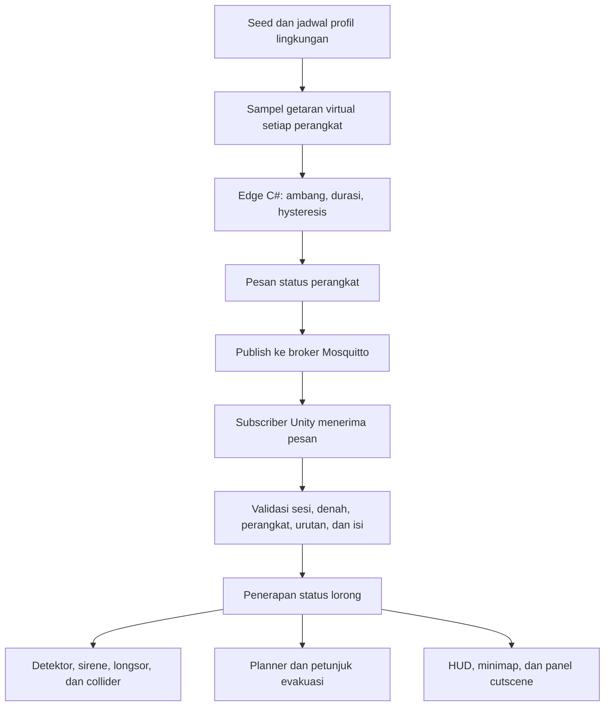

# Deskripsi lengkap simulasi SAFE-MINING EVAC

Dokumen terpadu berdasarkan implementasi proyek per **27 September 2026**, termasuk integrasi branch `feat/irawan` dan panel cutscene longsor. Scene utama adalah `Assets/Scenes/SafeMining_Experience.unity`, dengan Unity **6000.3.23f1**.

Dokumen ini menjelaskan tujuan, lingkungan, cara penggunaan, alur data, perbedaan versi sebelum dan sesudah MQTT, serta cara membaca hasil simulasi. Dokumen bertanggal lebih lama tetap berguna sebagai riwayat; keterangan lama tentang timeline, WebSocket, atau lingkup cutscene perlu dibaca sesuai pembaruan di sini.

## Daftar isi

1. [Gambaran umum dan tujuan](#1-gambaran-umum-dan-tujuan)
2. [Istilah yang digunakan](#2-istilah-yang-digunakan)
3. [Lingkungan tambang dan denah](#3-lingkungan-tambang-dan-denah)
4. [Mode Cerita dan FPP](#4-mode-cerita-dan-fpp)
5. [Navigasi adaptif dan statis](#5-navigasi-adaptif-dan-statis)
6. [Skenario, seed, dan waktu kejadian](#6-skenario-seed-dan-waktu-kejadian)
7. [Sensor virtual dan keputusan edge](#7-sensor-virtual-dan-keputusan-edge)
8. [Peran MQTT dan alur sistem terbaru](#8-peran-mqtt-dan-alur-sistem-terbaru)
9. [Perbedaan sebelum dan sesudah MQTT](#9-perbedaan-sebelum-dan-sesudah-mqtt)
10. [Tampilan informasi dan cutscene](#10-tampilan-informasi-dan-cutscene)
11. [Pause, reset, hasil akhir, dan gangguan koneksi](#11-pause-reset-hasil-akhir-dan-gangguan-koneksi)
12. [Cara menjalankan dan mencoba simulasi](#12-cara-menjalankan-dan-mencoba-simulasi)
13. [Pengaturan yang dapat diubah](#13-pengaturan-yang-dapat-diubah)
14. [Ekspor data dan arti metrik](#14-ekspor-data-dan-arti-metrik)
15. [Cara melakukan perbandingan eksperimen](#15-cara-melakukan-perbandingan-eksperimen)
16. [Struktur implementasi](#16-struktur-implementasi)
17. [Validasi dan batas implementasi](#17-validasi-dan-batas-implementasi)
18. [Pertanyaan umum dan dokumen lanjutan](#18-pertanyaan-umum-dan-dokumen-lanjutan)

## 1. Gambaran umum dan tujuan

SAFE-MINING EVAC adalah simulasi evakuasi seorang pekerja dari tambang bawah tanah menuju zona aman. Lingkungan berisi lorong, persimpangan, perangkat deteksi, dan lokasi yang dapat mengalami longsor. Ketika kondisi berubah, sistem memperlihatkan peringatan dan penutupan lorong, lalu memberikan petunjuk evakuasi sesuai jenis navigasi yang dipilih.

Simulasi digunakan untuk memperlihatkan hubungan antara **kondisi lingkungan, deteksi bahaya, pengiriman informasi, perubahan keterlintasan lorong, dan keputusan rute**. Pengguna dapat mengamati evakuasi otomatis atau mengendalikan pekerja secara langsung. Hasil sesi dapat diekspor untuk membandingkan navigasi adaptif dengan rute statis.

Pada konfigurasi bawaan terbaru, alurnya adalah:

**Getaran lingkungan virtual → pemrosesan edge virtual → broker MQTT → penerimaan dan validasi Unity → penerapan bahaya → navigasi dan tampilan.**

Tiga pilihan berikut mempunyai fungsi berbeda dan dapat dikombinasikan:

| Pilihan | Mengatur apa? | Pilihan yang tersedia |
|---|---|---|
| Mode interaksi | Siapa yang menggerakkan pekerja | Cerita atau FPP |
| Navigasi | Cara menentukan petunjuk/rute | Adaptif atau statis |
| Sumber bahaya | Cara status bahaya masuk ke simulasi | MQTT edge, edge lokal, atau timeline lama |

Sebagai contoh, **FPP + Adaptif + MQTT** berarti pemain menggerakkan pekerja sendiri, petunjuk rute menyesuaikan keadaan, dan status bahaya diterapkan melalui MQTT. **Cerita + Statis + MQTT** tetap menerima status bahaya melalui broker, tetapi pekerja otomatis mengikuti rute awal sebagai pembanding.

## 2. Istilah yang digunakan

| Istilah | Arti dalam proyek ini |
|---|---|
| FPP | First Person Perspective, yaitu pandangan dari posisi mata pekerja |
| Sensor virtual | Pembacaan getaran yang dihasilkan perangkat lunak, dengan intensitas simulasi 0 sampai 1 |
| Detektor | Model perangkat di dinding yang menunjukkan ID, status, lampu, dan peringatan lokasi |
| Edge | Pemrosesan dekat sumber data secara konseptual; pada proyek ini berupa modul C# dalam Unity yang mengubah sampel menjadi status |
| MQTT | Protokol pertukaran pesan yang digunakan untuk mengirim hasil status edge melalui broker |
| Broker | Proses Mosquitto yang menerima publikasi dan meneruskannya kepada pelanggan topik |
| Publish / subscribe | Mengirim pesan ke topik / berlangganan pesan pada topik |
| Planner | Modul yang mencari rute menuju zona aman berdasarkan graf lorong |
| Reroute | Perubahan sisa rute atau tujuan akibat pembaruan bahaya |
| Seed | Angka dasar pembangkitan skenario dan getaran agar percobaan dapat diulang |
| LegacyTimeline | Sumber pembanding yang menerapkan status bahaya langsung berdasarkan jadwal |
| Cutscene | Dalam proyek ini, panel kamera kecil yang memperlihatkan lokasi longsor secara live |
| Waktu simulasi | Waktu sesi yang berhenti saat pause; dapat berbeda dari waktu nyata komputer |

## 3. Lingkungan tambang dan denah

### Bentuk dan lokasi dasar

Lorong dibangun secara prosedural dari daftar koridor pada komponen `MiningSimulation`. Satu sel grid berukuran **6 meter**. Koordinat grid X/Y dipetakan ke sumbu dunia X/Z.

Denah bawaan mempunyai galeri pusat, galeri barat dan timur, serta beberapa koridor penghubung. Titik awal pekerja berada di `(0, -4)`. Tiga zona aman berada di `(0, 10)`, `(-4, 8)`, dan `(4, 8)`.

Tiga lokasi detektor dasar dipertahankan:

| ID | Lokasi grid | Area |
|---|---|---|
| D01 | `(0, 4)` | Galeri pusat |
| D02 | `(-4, 5)` | Galeri barat |
| D03 | `(4, 1)` | Galeri timur |

Lokasi tambahan ditentukan dari denah hingga maksimum 12 detektor. Jumlah yang tersedia bergantung pada kandidat lokasi yang memenuhi aturan. ID perangkat mengacu pada urutan titik detektor; `D01` mempunyai indeks kode 0.

### Bagian yang berubah saat simulasi

Geometri, collider, graf navigasi, dan minimap dibangun dari himpunan sel yang sama. Input koridor yang sama menghasilkan denah yang sama. Material permukaan, penyangga, rel, pipa, kabel, dan lampu membentuk tampilan tambang.

Selama satu sesi, bentuk lorong tetap. Perubahan dinamis berupa status normal/waspada/tertutup, timbunan longsor, sel yang tidak boleh dilalui, dan rute evakuasi. Seed skenario tidak mengacak bentuk denah.

Untuk mengubah denah, hentikan Play, ubah daftar **Corridors**, lalu mulai Play lagi. Setiap koridor harus horizontal atau vertikal. Generator memeriksa batas koordinat, jumlah sel, titik wajib, dan konektivitas awal. Denah yang awalnya terhubung tetap dapat kehilangan semua jalur aman setelah beberapa longsor.

### Pratinjau editor

Objek **EDITOR PREVIEW** menyediakan tampilan map dan sudut kamera untuk dokumentasi tanpa menjalankan sesi. Setelah mengubah koridor, gunakan **SafeMining > Documentation > Rebuild Editor Preview**, kemudian simpan scene.

Pratinjau dan kamera dokumentasi berbeda dari lingkungan runtime. Pratinjau dikeluarkan dari Play; menggeser objek pratinjau secara manual tidak mengubah denah simulasi.

## 4. Mode Cerita dan FPP

### Mode Cerita

Pekerja bergerak otomatis mengikuti rute yang tersedia dan kamera mengikuti dari belakang. Pada awal sesi terdapat waktu briefing sekitar empat detik sebelum gerakan otomatis dimulai. Kecepatan nominal pekerja adalah 2,8 m/s.

Mode ini sesuai untuk demonstrasi sistem dan perbandingan eksperimen karena pengguna tidak perlu menentukan gerak pekerja. Keberhasilan tetap bergantung pada denah, urutan bahaya, serta jenis navigasi. Sistem dapat menghasilkan kondisi terhalang.

### Mode FPP

Pengguna menggerakkan pekerja sendiri. Kamera berada pada ketinggian mata pekerja, sekitar 1,65 meter. Planner memberikan petunjuk, sedangkan keputusan mengikuti petunjuk dan gerakan tetap berada pada pengguna.

| Kontrol | Fungsi |
|---|---|
| WASD | Bergerak |
| Mouse | Mengarahkan pandangan |
| Shift | Berlari |
| F | Menghidupkan/mematikan lampu helm |
| G | Menghidupkan/mematikan kacamata navigasi AR |
| Esc | Pause atau lanjut |
| R | Mengulang mode, navigasi, dan seed sesi |
| Stik kiri/kanan gamepad | Bergerak/melihat |
| Klik stik kiri | Berlari |

Kecepatan bawaan FPP adalah 3,1 m/s untuk berjalan dan 4,8 m/s untuk berlari. Sensitivitas mouse, FOV, dan ayunan kamera dapat disesuaikan pada menu jeda. Kehilangan fokus aplikasi menjeda sesi FPP yang sedang berjalan.

Hasil FPP dipengaruhi perilaku pengguna. Karena itu, hasilnya perlu dipisahkan dari Mode Cerita ketika dianalisis.

## 5. Navigasi adaptif dan statis

### Navigasi adaptif

Planner memperhitungkan panjang perjalanan, penalti risiko pada sel waspada, dan larangan melewati sel tertutup. Ketika kondisi bahaya berubah, rute diperbarui dari posisi pekerja saat itu menuju zona aman dengan biaya total terendah yang tersedia.

Implementasi memakai pencarian berbobot Dijkstra ketika ada penalti waspada. Jika tidak ada penalti, pencarian menggunakan BFS karena biaya antar langkah seragam. Penalti waspada bawaan adalah 24 satuan biaya planner; angka ini merupakan pengaturan simulasi, bukan peluang longsor atau probabilitas cedera.

Peringatan kuning sudah dapat membuat jalur lain lebih baik sebelum longsor menutup lorong. Dalam FPP, rute adaptif juga diperbarui berdasarkan perubahan sel posisi dan interval pembaruan. Reroute tidak menjamin keberhasilan apabila semua jalur sudah terputus.

### Navigasi statis

Rute awal dipertahankan tanpa perencanaan ulang akibat perubahan bahaya. Pada Mode Cerita, pekerja berhenti ketika rute yang diikuti terhalang. Ini menghasilkan pembanding terhadap kemampuan adaptif mencari alternatif.

Dalam FPP, navigasi statis berarti petunjuk rutenya tetap. Pemain masih dapat memilih gerakan manual melalui lorong yang terbuka. Karena itu, FPP statis tidak sama dengan pekerja otomatis yang wajib mengikuti rute awal. Collider longsor tetap menghalangi lintasan fisik pada kedua jenis navigasi.

## 6. Skenario, seed, dan waktu kejadian

| Skenario | Perilaku |
|---|---|
| `Random` / Acak | Membuat lokasi dan jadwal kejadian acak terkontrol berdasarkan seed |
| `Scripted` / Tetap | Memakai urutan D01 dan D02 yang telah ditentukan untuk demonstrasi berulang |
| `NoHazards` / Tanpa bahaya | Tidak membuat kejadian longsor otomatis |

Pada Random, jumlah kejadian bawaan adalah tiga. Waktu dasar profil peringatan pertama adalah enam detik dengan tambahan acak 0–2 detik. Jarak profil warning ke danger bawaan empat detik; awal profil warning berikutnya diberi jarak dasar enam detik ditambah 0–2 detik setelah waktu danger sebelumnya.

Lokasi kejadian dipilih dari jaringan detektor, bukan seluruh titik dunia. Lokasi pertama diutamakan pada rute awal yang masih menyisakan alternatif ketika ditutup, jika kandidat tersebut tersedia. Kejadian berikutnya dapat tetap membuat evakuasi tidak mungkin. Setiap kejadian dalam jadwal Random menggunakan lokasi berbeda.

**Makna waktu jadwal bergantung pada sumber bahaya.** Dalam LegacyTimeline, waktu warning/collapse langsung memperbarui status lorong. Dalam kedua mode edge, waktu tersebut merupakan awal profil getaran warning/danger; status baru diterapkan setelah aturan edge terpenuhi dan, untuk MQTT, pesan diterima dari broker.

Contoh Scripted:

| Waktu simulasi | LegacyTimeline | Mode edge lokal/MQTT |
|---|---|---|
| 6 detik | D01 langsung waspada | Profil getaran D01 mulai warning |
| 10 detik | D01 langsung tertutup | Profil getaran D01 mulai danger |
| 19 detik | D02 langsung waspada | Profil getaran D02 mulai warning |
| 23 detik | D02 langsung tertutup | Profil getaran D02 mulai danger |

Dengan durasi ambang bawaan 0,5 detik, penerapan mode edge terjadi setelah awal profil tersebut. Pengiriman, penerimaan, dan pemrosesan per frame menambah perbedaan waktu pada MQTT. Angka 10 detik tidak berarti longsor MQTT harus terlihat tepat pada detik 10,000.

`Random Seed On Launch` memilih seed baru sekali ketika masuk Play. Tombol R dan ulang sesi menggunakan seed yang sama. Untuk pengulangan antar Play, nonaktifkan pilihan itu dan tetapkan `Scenario Seed`. Pilihan **Acak skenario baru** pada menu membuat seed baru untuk sesi berikutnya.

## 7. Sensor virtual dan keputusan edge

### Dari mana nilai getaran berasal?

Generator menghasilkan intensitas virtual berdasarkan seed, perangkat, nomor sampel, dan profil skenario. Nilainya berada pada skala **0..1**. Angka seperti 0,90 tidak mempunyai satuan percepatan fisik dan tidak berasal dari accelerometer sungguhan.

Pembacaan tidak dipicu oleh spawn point, jarak pekerja, atau pekerja memasuki collider sensor. Pekerja yang diam jauh dari D01 tetap dapat menerima peringatan D01 apabila profil getarannya berubah. Berdiri di dekat detektor pada NoHazards tidak menyalakan alarm karena kedekatan.

### Parameter bawaan

| Parameter | Nilai | Fungsi |
|---|---|---|
| Interval sampel | 0,05 detik / 20 Hz | Jarak waktu pembacaan virtual |
| Intensitas normal | 0,12 | Nilai dasar kondisi normal |
| Intensitas warning | 0,58 | Nilai dasar profil peringatan |
| Intensitas danger | 0,90 | Nilai dasar profil bahaya tinggi |
| Noise deterministik | ±0,04 | Variasi pembacaan yang dapat diulang |
| Ambang warning | ≥0,45 | Syarat intensitas untuk waspada |
| Ambang danger | ≥0,75 | Syarat intensitas untuk tertutup |
| Durasi minimum | 0,5 detik berturut-turut | Menolak lonjakan yang terlalu singkat |
| Ambang kembali normal | ≤0,30 | Syarat intensitas rendah untuk pemulihan waspada |
| Durasi stabil rendah | 1 detik | Lama kondisi rendah sebelum kembali normal |
| Pulsa danger | 2 detik | Durasi profil input danger |

Edge memeriksa intensitas beserta durasinya. Perbedaan ambang naik dan turun disebut *hysteresis*; tujuannya mengurangi pergantian status ketika nilai berfluktuasi dekat ambang.

| Level | Makna pada simulasi | Dampak |
|---|---|---|
| 0 | Normal | Lorong terbuka dan detektor hijau |
| 1 | Waspada | Detektor kuning; planner adaptif memberi penalti risiko |
| 2 | Tertutup | Detektor merah; longsor/collider aktif dan sel diblokir |

Dalam mode edge, level 2 terkunci sampai reset sesi. Getaran dapat kembali rendah setelah pulsa selesai sementara lorong tetap tertutup karena timbunan masih ada. Aturan ini berbeda dari status waspada yang dapat kembali normal setelah cukup stabil.

Istilah **edge intelligence** pada implementasi ini merujuk pada keputusan berbasis aturan ambang, durasi, hysteresis, dan penguncian status. Belum ada model machine learning, pelatihan AI, atau prediksi geologi. Pemetaan danger menjadi longsor adalah aturan demonstrasi.

## 8. Peran MQTT dan alur sistem terbaru

### Urutan proses



Edge menentukan status perangkat. MQTT membawa pesan status tersebut. Unity menerima dan memvalidasi pesan sebelum mengubah keadaan dunia. Planner Unity kemudian menghitung rute yang diperlukan.

**MQTT tidak menghitung rute dan tidak menentukan sendiri apakah getaran berarti longsor.** Penggunaannya membuat tahap pengiriman dan penerimaan menjadi bagian nyata dari percobaan, sehingga koneksi, keterlambatan, duplikasi, dan pemulihan dapat diamati.

### Bagian yang benar-benar terpisah

Sensor virtual, pemrosesan edge, subscriber, dan planner saat ini masih berada dalam aplikasi Unity. Broker Mosquitto berjalan sebagai proses terpisah melalui Docker. Jadi komunikasi MQTT benar-benar terjadi, tetapi belum ada perangkat edge fisik atau layanan Python terpisah yang melakukan keputusan.

Status dipublikasikan ketika berubah dan sebagai snapshot sekitar satu detik waktu simulasi. Seluruh sampel getaran 20 Hz tidak dikirim satu per satu sebagai stream MQTT. Pembacaan sampel tetap tersedia melalui event lokal dan trace untuk evaluasi.

### Identitas pesan dan validasi

Topik status mengikuti pola:

```text
safe-mining/v1/{sessionId}/edge/{deviceId}/status
```

Pesan membawa versi skema, ID sesi, ID denah, ID kejadian, ID perangkat, nomor urut, waktu simulasi, intensitas getaran, level, dan sumber. Sebagai contoh, `deviceId = D01` menunjukkan perangkat pertama, sedangkan `sequence` membedakan urutan pesan perangkat itu.

Unity menolak pesan rusak, field tidak sesuai, perangkat/sesi/denah asing, waktu tidak valid, duplikat atau pesan lama, serta upaya membuka kembali level tertutup dalam mode edge. Sesi baru memperoleh identitas baru sehingga pesan sesi sebelumnya tidak digunakan untuk sesi berikutnya.

Transport menggunakan bagian MQTT 3.1.1 TCP dengan QoS 1, ACK, pengiriman ulang, keepalive, dan reconnect yang diperlukan demo. Pengiriman ulang dapat menghasilkan duplikat, sehingga validator tetap diperlukan. ACK broker dan penerimaan Unity dicatat sebagai tahap berbeda; ACK belum berarti keadaan lorong telah berubah.

Konfigurasi bawaan memakai Mosquitto `2.0.22` pada `127.0.0.1:1883`. Container hanya memetakan port ke loopback host. Adapter proyek ditujukan untuk demonstrasi TCP lokal, belum memakai TLS/autentikasi, dan bukan klien MQTT umum untuk semua target platform.

## 9. Perbedaan sebelum dan sesudah MQTT

### Alur sebelumnya: timeline langsung

Pada alur pembanding lama, jadwal memberi perintah seperti “detik 6: waspada” dan “detik 10: tertutup”. Unity langsung memperbarui bahaya dan rute sesuai perintah itu.

```text
Jadwal/perintah bahaya → perubahan status lorong → navigasi dan tampilan
```

Alur ini berguna untuk menguji gerak, visual, dan planner dengan kondisi yang terkontrol. Namun, perubahan statusnya belum bergantung pada pembacaan getaran, keputusan ambang, atau penerimaan hasil dari broker.

### Alur terbaru: keputusan sensor melewati broker

Pada mode MQTT, jadwal mengubah **input getaran**, kemudian edge menentukan level berdasarkan sampel. Status baru sampai ke dunia simulasi setelah pesan melewati broker dan lolos validasi.

```text
Jadwal profil → getaran → keputusan edge → MQTT → validasi/penerapan → navigasi dan tampilan
```

| Aspek | Sebelumnya: LegacyTimeline | Sekarang: MqttEdgeSimulation |
|---|---|---|
| Yang ditentukan jadwal | Waktu perubahan status bahaya langsung | Waktu awal profil getaran |
| Pembacaan sensor | Tidak diperlukan untuk menerapkan jadwal | Sampel virtual periodik menjadi input edge |
| Keputusan waspada/tertutup | Level diperintahkan jadwal | Level dihitung dari intensitas dan durasi |
| Peran koneksi | Timeline berjalan tanpa broker | Penerapan hasil bergantung penerimaan MQTT |
| Pemicu dari posisi pemain | Timeline tidak memerlukannya | Generator edge juga tidak memerlukannya |
| Penerapan status | Langsung melalui jalur legacy | Setelah publish, receive, dan validasi |
| Pesan ulang/sesi lama | Tidak ada tahap MQTT dalam timeline | Diperiksa lewat identitas sesi dan urutan |
| Ketika broker mati | Tidak memengaruhi timeline | Keputusan lokal dapat berlanjut, penerapan baru menunggu data |
| Pemulihan longsor | Jalur legacy mengizinkan perintah level 0 eksplisit | Level 2 terkunci sampai reset |
| Bukti proses | Event gameplay dan perubahan rute | Ditambah trace sampel, keputusan, publish, receive, apply, route |
| Pertanyaan yang dapat diuji | Bagaimana pekerja/planner merespons perubahan bahaya? | Bagaimana seluruh rantai deteksi, komunikasi, dan respons bekerja? |

MQTT tidak otomatis membuat rute lebih pendek, evakuasi lebih cepat, atau hasil lebih aman. Algoritma navigasi tetap menentukan rute; pengiriman pesan bahkan menambah tahap waktu dibanding penerapan langsung. Nilai tambah MQTT adalah adanya jalur komunikasi yang dapat diamati dan diuji.

### Edge lokal sebagai pilihan ketiga

`LocalEdgeSimulation` memakai generator getaran, keputusan ambang, dan validasi yang sama dengan mode edge, tetapi menerapkan hasil secara lokal tanpa broker.

| Sumber | Alur | Kebutuhan broker | Kegunaan |
|---|---|---|---|
| `LegacyTimeline` | Jadwal → bahaya | Tidak | Pembanding perilaku lama |
| `LocalEdgeSimulation` | Getaran → edge → validasi → bahaya | Tidak | Mencoba pemrosesan sensor tanpa jaringan |
| `MqttEdgeSimulation` | Getaran → edge → MQTT → validasi → bahaya | Ya | Mencoba rantai komunikasi lengkap |

Dengan demikian, “tanpa MQTT” bisa berarti timeline lama atau edge lokal. Keduanya perlu disebutkan secara jelas ketika melaporkan hasil.

### Kedudukan WebSocket lama

`MiningTelemetry` menyediakan WebSocket opsional untuk mengirim snapshot posisi, mode, bahaya, dan metrik. Koneksi bawaan nonaktif. Contoh server Python ada pada `Tools/telemetry_server.py`, dengan endpoint bawaan `ws://127.0.0.1:8765`.

Perintah bahaya dari WebSocket hanya diterapkan saat sumber aktif **LegacyTimeline** dan sesi berjalan. Pada mode edge lokal/MQTT, perintah tersebut tidak boleh melewati pipeline edge. Server Python contoh ini bukan modul keputusan edge atau planner Python.

### Perubahan visual yang menyertai update

Commit `8b9ccd9` dari `feat/irawan` menambahkan HUD alur sensor–edge–broker–rute. Pembaruan setelah integrasi menambahkan panel kamera longsor pada kedua mode serta memperbaiki posisi panel dan pemilihan pembacaan sensor.

Panel kamera adalah fitur tampilan tersendiri. Panel dapat bekerja pada ketiga sumber karena membaca status lorong yang sudah diterapkan; keberadaan panel tidak menjadi bukti bahwa MQTT sedang digunakan. Periksa label sumber dan trace sesi untuk memastikan sumber yang aktif.

## 10. Tampilan informasi dan cutscene

### Elemen tampilan

| Elemen | Informasi yang ditampilkan |
|---|---|
| Panel misi | Mode, fase, dan keadaan evakuasi |
| Panel alur deteksi | Sampel getaran, status edge, transport, pesan terapan, dan target exit |
| Jaringan detektor | Sumber/koneksi serta peringatan perangkat terakhir |
| Minimap | Bentuk map, pekerja, zona aman, titik bahaya, dan rute ketika navigasi ditampilkan |
| Radio tim | Dialog tentang peringatan, longsor, dan hasil sesi |
| Kacamata navigasi | Arah seperti lurus/belok/putar balik, target zona aman, dan jarak rute |
| Metrik | Waktu simulasi, jumlah perubahan rute, serta respons komputasi |
| Lampu/display/sirene perangkat | Penanda kondisi lokasi di dunia 3D |

HUD memilih pembacaan terbaru dengan intensitas tertinggi di antara perangkat agar getaran berbahaya tidak tertutup oleh sampel normal perangkat lain. Baris sampel dan pesan yang terakhir diterapkan dapat menyebut ID berbeda karena mewakili dua informasi berbeda.

Ketika pulsa getaran selesai, angka sampel dapat rendah sementara perangkat tetap merah dan lorong tertutup. Ini sesuai penguncian status longsor. Pada LegacyTimeline, panel alur menampilkan sumber legacy karena tidak ada sesi sensor edge.

### Kotak cutscene longsor

Panel kecil berada di atas dialog radio, berukuran 380×264 pada layout acuan 1600×900. Kamera tambahan merender lokasi ke tekstur 640×360. Panel menampilkan ID perangkat, grid lokasi, kondisi lorong, dan jumlah lokasi yang menunggu.

Perilakunya adalah:

1. Level tertutup yang **sudah diterapkan** memicu satu tayangan per perangkat per sesi. Waspada saja belum memunculkan panel.
2. Setiap lokasi ditampilkan selama lima detik waktu simulasi. Beberapa lokasi mengantre; kejadian dalam satu frame diurutkan berdasarkan ID perangkat.
3. Tayangan berupa kamera live. Lokasi pertama dapat terlihat sedang runtuh; lokasi yang menunggu dapat sudah menjadi timbunan saat gilirannya tampil.
4. Snapshot berulang tidak memutar ulang tayangan. Sesi baru mengizinkan perangkat yang sama tampil kembali.
5. Kamera utama, kontrol FPP, dan gerakan Cerita tetap berjalan. Kacamata AR yang dimatikan tidak mematikan panel radio/cutscene.
6. Pause menyembunyikan panel dan menghentikan rendering kamera tambahan sambil mempertahankan antrean/waktu. Resume melanjutkan tayangan.
7. Menu, hasil akhir, dan restart membersihkan tayangan serta antrean. Karena itu, lokasi yang belum mendapat giliran tidak dipaksa tampil setelah sesi berakhir.

Cutscene tidak memicu longsor, tidak menunda penerapan bahaya, dan tidak mengubah perhitungan rute. Pada MQTT, keputusan edge yang belum diterima tidak memunculkan panel. Kamera tambahan dibuat saat diperlukan dan tidak menambahkan AudioListener kedua.

Pratinjau: [FPP](Previews/cutscene-fpp.png), [Cerita](Previews/cutscene-story.png), dan [pergantian ke D02](Previews/cutscene-second-device.png). Gambar uji tersebut memakai LegacyTimeline untuk menerapkan kejadian serentak; pengujian MQTT dilakukan terpisah.

## 11. Pause, reset, hasil akhir, dan gangguan koneksi

### Keadaan sesi

| Keadaan | Makna |
|---|---|
| `Menu` | Memilih konfigurasi dan mode sebelum mulai |
| `Running` | Sesi, gerakan, dan pemrosesan berjalan |
| `Paused` | Waktu simulasi serta penerapan bahaya berhenti sementara |
| `Success` | Pekerja mencapai salah satu zona aman |
| `Blocked` | Sesi dihentikan karena kondisi terhalang atau kondisi gagal yang dijelaskan pada dialog |

Sesi bisa terhalang karena tidak ada rute adaptif, rute otomatis statis tertutup, atau longsor terjadi tepat di sel pekerja. Gangguan konfigurasi dan posisi di luar map juga dapat menghentikan sesi. Tidak ada restart otomatis untuk menyembunyikan hasil gagal.

R mengulang mode dan seed yang sama, mengembalikan pekerja, membersihkan bahaya dan metrik, serta membuat identitas sesi edge baru. Replay mengulang input deterministik; waktu penerimaan jaringan tetap dapat bervariasi.

### Pause dan MQTT

Saat pause, generator dan penerapan berhenti mengikuti clock simulasi. Worker MQTT tetap melayani koneksi; pesan masuk dapat mengantre sampai resume. Menu, hasil akhir, disable, dan destroy menghentikan transport sesuai lifecycle sesi.

### Broker tidak tersedia

Tidak ada perpindahan otomatis dari MQTT ke edge lokal. Keputusan lokal dapat terbentuk saat koneksi putus, tetapi status dunia terakhir dipertahankan sampai ada penerimaan valid. Pada sesi baru yang belum menerima status, dunia dapat tetap normal meskipun input virtual sudah meningkat.

| Penanda | Arti |
|---|---|
| `DataStale` | Data belum lengkap atau sudah terlalu lama tanpa penerimaan yang memenuhi pemeriksaan |
| `HadDisconnect` | Sesi pernah mengalami putus koneksi |
| `DataLoss` | Kehilangan data terdeteksi, misalnya antrean atau batas trace terlampaui |

Antrean masuk/keluar MQTT dibatasi 256 pesan. Trace demo dibatasi 100.000 entri. Ketika `DataLoss` terjadi, penerapan dikunci dan eksperimen perlu diulang; melanjutkan sesi saja tidak mengembalikannya menjadi eksperimen valid. Snapshot baru setelah reconnect membantu sinkronisasi, tetapi riwayat gangguan tetap dicatat.

## 12. Cara menjalankan dan mencoba simulasi

### Menjalankan dengan MQTT

1. Buka proyek menggunakan Unity 6000.3.23f1 dan buka `Assets/Scenes/SafeMining_Experience.unity`.
2. Pastikan Docker Desktop berjalan. Dari root proyek, jalankan:

   ```powershell
   docker compose -p safe-mining-edge -f Tools/Mqtt/compose.yaml up -d
   ```

3. Pada Inspector `MiningSimulation`, gunakan `Hazard Source = MqttEdgeSimulation`. Host bawaan `127.0.0.1`, port `1883`.
4. Tekan Play. Pilih navigasi dan skenario, kemudian mulai Mode Cerita atau FPP. Koneksi MQTT dibuka saat sesi dimulai.
5. Amati panel sumber/koneksi, detektor, perubahan rute, dan cutscene.
6. Setelah selesai menggunakan broker, hentikan dengan:

   ```powershell
   docker compose -p safe-mining-edge -f Tools/Mqtt/compose.yaml down
   ```

### Menjalankan tanpa broker

Sebelum memulai sesi, pilih `Hazard Source = LocalEdgeSimulation` untuk tetap menguji pembacaan dan keputusan edge. Pilih `LegacyTimeline` jika ingin membandingkan alur jadwal langsung. Pilihan sumber berada pada Inspector, terpisah dari tombol mode dan skenario pada menu.

### Urutan demonstrasi yang mudah diamati

| Percobaan | Yang diamati |
|---|---|
| FPP + Adaptif + Scripted + MQTT, pekerja tetap diam | D01 tetap mendeteksi profil lingkungan; posisi pemain bukan pemicu |
| Tunggu penerapan penutupan D01 | Detektor merah, timbunan muncul, panel D01 tampil, rute diperiksa ulang |
| Lanjut sampai kejadian D02 selama sesi masih berjalan | Lokasi bahaya bertambah dan panel menampilkan perangkat terkait |
| Pause saat panel aktif, lalu lanjut dan R | Waktu/antrean berhenti saat pause dan bersih saat reset |
| Cerita + Scripted, bandingkan adaptif/statis | Adaptif mencari alternatif; pekerja statis berhenti jika rutenya tertutup |
| NoHazards, berdiri dekat detektor | Tidak ada alarm akibat kedekatan pemain |
| MQTT dengan broker dimatikan dalam percobaan terpisah | Tidak ada fallback ke penerapan lokal; label/trace menunjukkan gangguan |

Gunakan scene utama, bukan `SafeMiningEvac_Demo.unity`. Scene demo lama mempunyai pengendali dan alur berbeda.

## 13. Pengaturan yang dapat diubah

| Kelompok | Parameter penting | Waktu perubahan |
|---|---|---|
| Denah | `Corridors` | Stop Play, ubah, lalu mulai Play kembali |
| Kamera FPP | Sensitivitas, FOV, ayunan | Inspector/menu jeda; simpan default di scene saat tidak Play |
| Gerak FPP | `Walk Speed`, `Sprint Speed` | Tetapkan konsisten untuk perbandingan eksperimen |
| Skenario | Jenis, seed, random seed saat launch | Sebelum sesi baru |
| Kejadian acak | Jumlah kejadian, waktu warning awal, jarak kejadian, durasi warning | Sebelum sesi baru |
| Navigasi | Adaptif/statis dan `Warning Risk Penalty` | Pilih sebelum sesi untuk eksperimen yang konsisten |
| Sumber bahaya | `Hazard Source` | Sebelum mulai sesi |
| Edge | Interval, profil, noise, ambang, durasi | Disalin saat Begin; perubahan dipakai pada sesi berikutnya |
| MQTT | Host, port, pengaturan broker | Disalin saat Begin; perubahan dipakai pada sesi berikutnya |

Parameter edge diperiksa sebelum sesi berjalan. Kombinasi ambang/profil yang tidak valid menghentikan sesi dengan penjelasan konfigurasi. Mengganti pengaturan Inspector di tengah sesi tidak boleh diasumsikan telah mengganti konfigurasi edge aktif.

## 14. Ekspor data dan arti metrik

Gunakan **Ekspor hasil evaluasi (.csv)** pada panel jeda atau hasil. Lokasi penyimpanan adalah `Application.persistentDataPath/Evaluasi`; path lengkap ditampilkan oleh aplikasi. Nama file memakai awalan waktu UTC, mode, dan jenis navigasi.

| Berkas | Isi |
|---|---|
| `_summary.csv` | Mode, navigasi, outcome, waktu, jarak, paparan, kontak, reroute, respons maksimum, skenario, seed, sumber, sesi, dan kualitas data |
| `_events.csv` | Waktu dan rincian perubahan bahaya/rute serta kejadian sesi |
| `_layout.csv` | Koordinat sel untuk mencocokkan denah percobaan |
| `_scenario.csv` | Jadwal perangkat dan waktu warning/collapse atau awal profil sesuai sumber |
| `_config.json` | Konfigurasi eksperimen, termasuk arti jadwal, parameter edge/broker, serta identitas sesi/denah |
| `_edge.jsonl` | Tambahan pada sesi edge: sampel, keputusan, pengiriman, penerimaan, penerapan, route, penolakan, dan gangguan |

LegacyTimeline tidak membuat sesi edge sehingga tidak menghasilkan trace `_edge.jsonl`. Field `scheduleSemantics` membantu membaca jadwal: `direct_hazard_times` untuk legacy dan `vibration_profile_onsets` untuk mode edge.

| Metrik | Arti dan cara membaca |
|---|---|
| `outcome` | Gunakan `Success` atau `Blocked` untuk hasil akhir |
| `elapsed_s` | Waktu simulasi, termasuk briefing, tidak bertambah saat pause |
| `distance_m` | Akumulasi perpindahan horizontal pekerja |
| `exposure_s` | Waktu berada dalam radius 4,5 meter dari pusat longsor tertutup |
| `hazard_contacts` | Masuk ke perimeter bahaya dan kejadian longsor tepat di sel pekerja |
| `reroutes` | Pembaruan bahaya yang mengubah sisa rute atau exit; bukan seluruh panggilan planner |
| `max_planning_ms` | Waktu maksimum komputasi lokal perencanaan pada pembaruan bahaya |

`elapsed_s` memakai delta simulasi yang dibatasi 0,05 detik per frame. Pada frame rate rendah, waktu ini dapat berbeda dari waktu dinding komputer. Paparan/kontak adalah ukuran virtual, bukan model cedera.

`max_planning_ms` tidak mengukur keseluruhan sensor → broker → layar. Trace edge memisahkan `simulationTimeS` dari `monotonicMs`, yaitu waktu lokal sesi yang tetap berjalan saat pause. Selisih tahap `publish_wire` dan `receive` dapat dipakai mengamati putaran broker lokal, tetapi tidak boleh disebut latensi perangkat fisik.

Urutan trace umum adalah `sample → decision → publish_queued → publish_wire → receive → apply → route`, dengan `puback` dicatat terpisah. ACK dan penerimaan dapat tercatat pada urutan waktu berbeda. Gunakan ID kejadian untuk menghubungkan tahap yang bersangkutan dan `monotonicMs` ketika menganalisis waktunya.

## 15. Cara melakukan perbandingan eksperimen

Untuk membandingkan **navigasi**, pertahankan mode interaksi, denah, seed, skenario, parameter getaran, sumber bahaya, dan kecepatan yang sama. Ubah hanya adaptif/statis, jalankan sampai hasil akhir, lalu ekspor masing-masing sesi.

Untuk membandingkan **jalur komunikasi**, gunakan edge lokal dan MQTT dengan konfigurasi identik. Perbedaan utama kedua sumber ini adalah transport. Membandingkan LegacyTimeline dengan MQTT sekaligus mengubah pemrosesan sensor dan cara penerapan, sehingga seluruh perbedaannya tidak boleh dikaitkan hanya pada jaringan.

Outcome harus dibaca sebelum waktu. Sesi statis yang berhenti cepat karena terhalang bukan evakuasi yang lebih cepat berhasil. Pisahkan hasil FPP dari Cerita serta hasil bergangguan jaringan dari hasil normal. Gunakan beberapa seed dan denah jika ingin menarik kesimpulan yang lebih luas.

Pengulangan seed memastikan jadwal dan input virtual konsisten. Gerakan pemain serta waktu penerimaan MQTT tetap dapat bervariasi. Pengujian regresi yang lolos membuktikan perilaku yang diuji bekerja; hasil tersebut belum menggantikan pengumpulan dan analisis eksperimen penelitian.

## 16. Struktur implementasi

Path kode berikut relatif terhadap `Assets/Scripts/`.

| Berkas/kelompok | Tanggung jawab |
|---|---|
| `MiningSimulation.cs` | Lifecycle sesi, pilihan mode/sumber, aktor, penerapan bahaya, integrasi planner, dan ekspor |
| `MineLayout.cs` | Validasi sel/koridor, geometri, graf, serta pencarian rute |
| `MineSurface.cs` | Pembuatan material dan variasi permukaan |
| `MiningHazardScenario.cs` | Lokasi detektor dan jadwal skenario |
| `Edge/MiningEdgeModel.cs` | Pengaturan, kontrak pesan, generator getaran, aturan edge, dan validator |
| `Edge/MiningEdgeSession.cs` | Orkestrasi sesi edge, penghubung transport, kualitas data, dan trace |
| `Edge/MiningEdgeJson.cs` | Pemeriksaan struktur/tipe payload JSON |
| `Networking/MiningMqttClient.cs` | Koneksi dan pertukaran pesan MQTT TCP |
| `MiningLandslideDetector.cs` | Tampilan/lampu/sirene perangkat deteksi |
| `MiningRockfall.cs` | Animasi batu longsor |
| `MiningHUD.cs` | Menu, dialog, minimap, petunjuk, metrik, dan panel alur |
| `MiningLandslideCutscene.cs` | Kamera lokasi dan antrean cutscene dari status yang sudah diterapkan |
| `MiningTelemetry.cs` | Telemetri WebSocket opsional dan pembatasan perintah legacy |
| `Editor/MiningEdgeValidation.cs` | Pengujian edge, MQTT nyata, dan integrasi cutscene |
| `Editor/MiningCutsceneValidation.cs` | Pengujian panel/antrean serta pengambilan screenshot |

Scene mengatur konfigurasi awal, sedangkan HUD, lingkungan, dan panel tambahan dibentuk oleh kode ketika runtime. Pemisahan ini membantu penelusuran: masalah input getaran diperiksa pada generator/edge; masalah pesan pada sesi/klien MQTT; masalah rute pada planner; masalah panel pada HUD/cutscene.

## 17. Validasi dan batas implementasi

### Bukti pengujian yang tersedia

Pengujian terbaru berjalan pada salinan proyek menggunakan Unity Editor Windows 6000.3.23f1. Runner edge/MQTT dan runner cutscene selesai dengan exit code 0.

- Edge: durasi ambang, penolakan lonjakan singkat, hysteresis, dan penguncian longsor.
- Input deterministik: 32 seed dan kesamaan waktu keputusan pada pembagian langkah waktu berbeda.
- Kontrak: field tidak valid, identitas asing, urutan lama, dan duplikat ditolak.
- Gameplay: FPP diam menerima bahaya, Cerita adaptif/statis memberi perilaku pembanding, pause/reset menjaga keadaan.
- MQTT nyata: publish/subscribe QoS 1, pesan saat pause, reconnect, broker tidak tersedia, dan batas antrean.
- Cutscene: tiga lokasi berurutan, FPP/Cerita, durasi, pause, reset, duplikat, menu, dan kamera utama yang tetap berjalan.
- Tampilan: screenshot pada resolusi acuan 1600×900 diperiksa.

Bukti rinci: [hasil edge/MQTT terbaru](Validation/edge-cutscene-2026-09-27.txt) dan [hasil cutscene terbaru](Validation/cutscene-2026-09-27.txt). Log mencatat exception indeks internal `UnityEditor.Search.SearchDatabase` saat startup editor; pemeriksaan runtime tetap selesai. Catatan tersebut tidak disembunyikan dari laporan validasi.

### Batas yang perlu dipahami saat menjelaskan proyek

Sensor dan edge masih virtual, dijalankan dalam Unity. Belum ada pembacaan sensor fisik, kalibrasi getaran, deployment perangkat edge, model geologi, atau pengujian keselamatan tambang nyata. Posisi pekerja memakai koordinat Unity, belum mensimulasikan pengukuran UWB dengan noise dan anchor.

Planner berada di C#, belum berupa layanan keputusan Python terpisah. Lingkungan menggunakan satu pekerja dan denah tetap selama sesi. Panel longsor adalah tayangan kamera live, bukan rekaman atau replay kejadian.

MQTT menggunakan TCP lokal. Target WebGL tidak mendukung jalur socket TCP ini. Build player dan rasio layar lain belum termasuk bukti pengujian terbaru. Klaim penelitian perlu mengikuti hasil eksperimen yang benar-benar dikumpulkan, terpisah dari keberhasilan uji fungsi.

## 18. Pertanyaan umum dan dokumen lanjutan

**Mengapa getaran tinggi tetapi longsor belum muncul?**

Ambang perlu bertahan selama durasi minimum. Pada MQTT, hasilnya juga harus diterima dan lolos validasi. Periksa sumber/koneksi serta kualitas data, bukan hanya angka getaran.

**Mengapa lorong masih merah ketika getaran sudah normal?**

Level tertutup terkunci sampai reset pada mode edge. Pulsa getaran berhenti tidak menghilangkan timbunan longsor.

**Apakah cutscene menandakan MQTT berhasil?**

Panel menandakan status tertutup sudah diterapkan, dan dapat muncul juga pada sumber lokal/legacy. Untuk memastikan MQTT, lihat sumber aktif dan trace pengiriman/penerimaan.

**Mengapa gambar cutscene berbeda dari dialog terakhir?**

Cutscene mempunyai antrean lokasi, sedangkan dialog dapat sudah menerima kejadian terbaru. ID dan grid pada panel menjelaskan lokasi yang sedang ditayangkan.

**Mengapa tidak semua lokasi dalam jadwal terlihat?**

Sesi dapat berakhir sebelum jadwal berikutnya. Lokasi dalam antrean cutscene juga dibersihkan ketika sesi selesai. Jadwal lengkap tetap tersedia pada ekspor.

**Apakah pemain harus mendekati edge device supaya aktif?**

Tidak. Input virtual berasal dari profil lingkungan; posisi pekerja digunakan untuk navigasi, gerakan, dan evaluasi paparan.

**Mengapa setelah R hasilnya mirip?**

R mempertahankan seed untuk replay. Gunakan **Acak skenario baru** jika menginginkan input skenario berbeda.

**Apakah MQTT menggantikan navigasi adaptif?**

Tidak. MQTT mengirim status; navigasi adaptif memakai status yang diterapkan untuk menghitung rute. Keduanya memiliki tugas berbeda.

Dokumen pendukung:

- [Panduan edge, MQTT, kontrak, dan konfigurasi](EDGE_MQTT.md).
- [Integrasi feat/irawan dan penjelasan cutscene](UPDATE_IRAWAN_CUTSCENE_2026-09-27.md).
- [Kontrol FPP dan tampilan tambang](FPP_AND_VISUALS.md).
- [Pengaturan koridor dan panduan dasar](SAFE_MINING.md), dengan memperhatikan catatan pembaruan sumber bahaya.
- [Audit kesesuaian paper dan protokol eksperimen](PAPER_ALIGNMENT_AND_RANDOM_HAZARDS.md), sebagai riwayat audit sebelum pembaruan MQTT.
- [Petunjuk broker lokal](../Tools/Mqtt/README.md).
